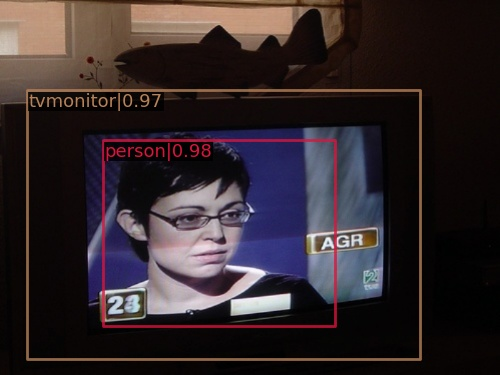

## 作业描述
使用预训练mask_rcnn模型在voc2007数据集上进行微调
## 实验设备
GTX3090
## 数据集
超算平台自带的公开数据集VOC2007
## 模型地址
链接：https://pan.baidu.com/s/1nHJe2r2kZvP1fDp2eiY3pA?pwd=oh68 

提取码：oh68
## 模型指标
|            Model            |  map  |                  Config                   |                             Download                              |
|:---------------------------:|:-----:|:-----------------------------------------:|:-----------------------------------------------------------------:|
| mask_rcnn(r50_fpn_1x_voc07) | 0.804 | [config](./mask_rcnn_r50_fpn_1x_voc07.py) | [model](https://pan.baidu.com/s/1nHJe2r2kZvP1fDp2eiY3pA?pwd=oh68) |

## 效果图展示

## 各类别召回与ap
|    class    | gts  | dets  | recall |  ap   |
|:-----------:|:----:|:-----:|:------:|:-----:|
|  aeroplane  | 285  |  795  | 0.961  | 0.882 |
|   bicycle   | 337  | 1142  | 0.944  | 0.868 |
|    bird     | 459  |  956  | 0.885  | 0.783 |
|    boat     | 263  | 1055  | 0.890  | 0.720 |
|   bottle    | 469  | 1701  | 0.889  | 0.755 |
|     bus     | 213  |  594  | 0.948  | 0.862 |
|     car     | 1201 | 2314  | 0.953  | 0.890 |
|     cat     | 358  |  900  | 0.955  | 0.848 |
|    chair    | 756  | 3135  | 0.866  | 0.687 |
|     cow     | 244  |  866  | 0.939  | 0.809 |
| diningtable | 206  | 1324  | 0.947  | 0.779 |
|     dog     | 489  | 1253  | 0.961  | 0.833 |
|    horse    | 348  | 1328  | 0.966  | 0.884 |
|  motorbike  | 325  |  947  | 0.945  | 0.831 |
|   person    | 4528 | 11186 | 0.957  | 0.877 |
| pottedplant | 480  | 2163  | 0.817  | 0.562 |
|    sheep    | 242  |  405  | 0.847  | 0.753 |
|    sofa     | 239  |  865  | 0.954  | 0.814 |
|    train    | 282  |  900  | 0.947  | 0.838 |
|  tvmonitor  | 308  | 1101  | 0.919  | 0.801 |
|   **mAP**   |      |       |        | 0.804 |
